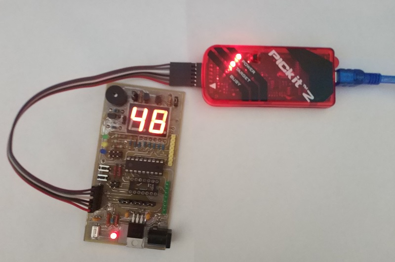

# LED blinking project

## Resources
[PIC16F648A datasheet](https://www.microchip.com/wwwproducts/en/PIC16F648A)  

## Additional information
[Code Examples](https://www.microchip.com/doclisting/TechDoc.aspx?type=CodeExamples)  
[Informations about the PIC microcontrollers](https://gputils.sourceforge.io/html-help/index.html)  
[PICmicro™ Mid-Range MCU Family Reference Manual](http://ww1.microchip.com/downloads/en/DeviceDoc/33023a.pdf)  

## Harware 
MCU PIC16F648A
PicKit2 programmer 

##### Pin assigments

| Signal   |      Pin      |
|----------|--------------:|
| rst | RA5 |
| RA1 | CC0 |  
| RA2 | CC1 |  
| RB0 | A |  
| RB1 | B |  
| RB2 | C |  
| RB3 | D |  
| RB4 | E |  
| RB5 | F |  
| RB6 | G |  
| RB7 | DP |  
